# AI学习笔记
已部署的模型：  
- llama3.1
- Qwen2
- FLUX.1
- SD1.5
- Qwen2.5
- Qwen2.5-coder
- FunASR
- MusicGen
- CosyVoice
- Whisper
- CogVideoX
- Qwen2VL
- BEN
- SD3.5
- EchoMimc
- llava
- F5-TTS/E2-TTS
- llama3.2
- FoleyCrafter
- GOT-OCR2.0
- Janus1.3B
- mPLUG-owl3
- OmniGen
- OmniParser
- mini-omni2
- YOLOv11
- PULID
- Pyramid-Flow  
- MinerU
- EchomimicV2  
- Marco-o1
......

To Do List
1. AI PPT
2. 会用表情包的模型
3. 命令行调用任意模型
4. 前端解析模型
5. AI教师，根据PPT内容进行授课
6. 模型模仿微信好友(多模态，主动性)
7. 调一个文笔像真人的模型
8. 使用Jina让大模型阅读网页
9. 帖子自动推荐
## 一、大模型
### （一）部署
#### 常见问题
（1）Python版本问题  
Python的版本不同可能导致库不兼容和语法不兼容  
例如
```python
a: str | null
```
这种语法仅支持python3.10及以上  

（2）build依赖时报错  
如果pip下载依赖时build出错，可以尝试使用conda安装，如果仍然出错考虑更换Python版本  

（3）模块导入出错  
如果运行报错
```bash
no module found "xxx"
```
先别急着执行pip install xxx  
这可能不是依赖的问题，而是模块导入的问题
此处以Janus1.3B为例  
在源码里我们会看到  
```python
import .janus
```
这样的语句  
但这并不是在导入PYPI的janus库，而是在导入同级目录的自定义模块janus  
此处的`.`即为同级目录  
类似的，还有
```python
import ..janus
```
表示从上级目录导入janus模块  
在这些自定义模块中，我们会发现存在一个`__init__.py`文件，尽管它往往是空的，但这恰恰就是python自定义模块的标识  
如果出现模块导入出错，请检查模块的路径是否正确，如果确实是在同级目录但报错，可以更改导入语句为
```python
import janus
```
把`.`去掉就不会报错了

#### NNLM
NNLM即神经网络语言模型，当今大模型的鼻祖，是2003年提出的，其实原理非常简单
```python
import torch
import torch.nn as nn
import torch.optim as optim
import torch.utils.data as Data
from torch.autograd import Variable
dtype = torch.FloatTensor

sentences = ["i like dog", "i love coffee", "i have milk"]
n_steps = 2
n_hidden = 2
m = 2

word_list = " ".join(sentences).split(" ")
print("未去重词表：", word_list)
word_list = list(set(word_list))
print("去重词表：", word_list)
word_dict = {w: i for i, w in enumerate(word_list)}
print("单词索引：", word_dict)
number_dict = {i: w for i, w in enumerate(word_list)}
print("索引单词：", number_dict)
num_words = len(word_dict)
print("单词总数：", num_words)

class NNLM(nn.Module):
    def __init__(self):
        super(NNLM, self).__init__()
        self.C = nn.Embedding(num_embeddings = num_words, embedding_dim = m)
        self.d = nn.Parameter(torch.randn(n_hidden).type(dtype))
        self.H = nn.Parameter(torch.randn(n_steps * m, n_hidden).type(dtype))
        self.U = nn.Parameter(torch.randn(n_hidden, num_words).type(dtype))
        self.b = nn.Parameter(torch.randn(num_words).type(dtype))
        self.W = nn.Parameter(torch.randn(n_steps * m, num_words).type(dtype))

    def forward(self, input):
        x = self.C(input)
        x = x.view(-1, n_steps * m)
        hidden_out = torch.tanh(torch.mm(x, self.H) + self.d)
        output = torch.mm(x, self.W) + torch.mm(hidden_out, self.U) + self.b
        return output

def make_batch(sentences):
    input_batch = []
    target_batch = []
    for sentence in sentences:
        word = sentence.split()
        input = [word_dict[w] for w in word[:-1]]
        target = word_dict[word[-1]]
        input_batch.append(input)
        target_batch.append(target)
    return input_batch, target_batch

input_batch, target_batch = make_batch(sentences)
input_batch = torch.LongTensor(input_batch)
target_batch = torch.LongTensor(target_batch)
print("input_batch:", input_batch)
print("target_batch：", target_batch)

model = NNLM()

criterion = nn.CrossEntropyLoss()
optimizer = optim.Adam(model.parameters(), lr=0.001)

for epoch in range(2000):
    optimizer.zero_grad()
    output = model(input_batch)
    loss = criterion(output, target_batch)
    if (epoch + 1) % 100 == 0:
        print("Epoch:{}".format(epoch + 1), "Loss:{:.4f}".format(loss))
    loss.backward()
    optimizer.step()

pred = model(input_batch).data.max(1, keepdim=True)[1]
print("Predict:", pred)
print([sentence.split()[:2] for sentence in sentences], "---->", [number_dict[n.item()] for n in pred.squeeze()])
```

```bash
未去重词表： ['i', 'like', 'dog', 'i', 'love', 'coffee', 'i', 'have', 'milk']
去重词表： ['love', 'have', 'i', 'milk', 'like', 'dog', 'coffee']
单词索引： {'love': 0, 'have': 1, 'i': 2, 'milk': 3, 'like': 4, 'dog': 5, 'coffee': 6}
索引单词： {0: 'love', 1: 'have', 2: 'i', 3: 'milk', 4: 'like', 5: 'dog', 6: 'coffee'}
单词总数： 7
input_batch: tensor([[2, 4],
        [2, 0],
        [2, 1]])
target_batch： tensor([5, 6, 3])
Epoch:100 Loss:2.4958
Epoch:200 Loss:1.8126
Epoch:300 Loss:1.3478
Epoch:400 Loss:1.0186
Epoch:500 Loss:0.7990
Epoch:600 Loss:0.6530
Epoch:700 Loss:0.5379
Epoch:800 Loss:0.4262
Epoch:900 Loss:0.3175
Epoch:1000 Loss:0.2278
Epoch:1100 Loss:0.1640
Epoch:1200 Loss:0.1213
Epoch:1300 Loss:0.0926
Epoch:1400 Loss:0.0729
Epoch:1500 Loss:0.0588
Epoch:1600 Loss:0.0484
Epoch:1700 Loss:0.0405
Epoch:1800 Loss:0.0344
Epoch:1900 Loss:0.0296
Epoch:2000 Loss:0.0257
Predict: tensor([[5],
        [6],
        [3]])
[['i', 'like'], ['i', 'love'], ['i', 'have']] ----> ['dog', 'coffee', 'milk']
```

#### GPT系列（GPT1、GPT2）
GPT是第一个Transformer模型，使用的是Transformer的解码器，是条件语言模型，根据上文推下文  
**GPT1**
```python
from transformers import pipeline, set_seed
generator = pipeline('text-generation', model='./gpt', device='cuda:0')

set_seed(42)

output = generator("I love you,", max_length=30, num_return_sequences=1, truncation=True)

print(output)
```

```bash
[{'generated_text': 'I love you, don\'t ever leave me. " he kissed me and i felt him stiffen as his body pressed against mine. " i\'m sorry'}]
```

**GPT2**
```python
from transformers import pipeline

generator = pipeline("text-generation", model="./gpt2", device="cuda:0")

result = generator(
    "Hello,",
    truncation=True,
    max_length=100
)

print(result)
```
```bash
[{'generated_text': 'Hello, I wanted to tell you that we have been working with the NIMBYist Committee for a lot of years and we have been very thorough in identifying many of the issues that we are about to deal with and working with them. I am very grateful for their help throughout these negotiations on these. I am also proud to have worked with Jim for some time. So much so that there have been a great deal of progress made, and more progress made than I can bear. So I want'}]
```
#### BERT
BERT是遮盖语言模型，使用整个Transformer，包含编码器和解码器，能填补文中的遮盖词
```python
from transformers import pipeline

unmasker = pipeline('fill-mask', model='./bert')

result = unmasker("I am [MASK] you are.")

print(result)
```

```bash
[{'score': 0.3266281187534332, 'token': 2040, 'token_str': 'who', 'sequence': 'i am who you are.'}, {'score': 0.19791413843631744, 'token': 2054, 'token_str': 'what', 'sequence': 'i am what you are.'}, {'score': 0.1181851178407669, 'token': 2469, 'token_str': 'sure', 'sequence': 'i am sure you are.'}, {'score': 0.06814499944448471, 'token': 2673, 'token_str': 'everything', 'sequence': 'i am everything you are.'}, {'score': 0.0540953129529953, 'token': 2035, 'token_str': 'all', 'sequence': 'i am all you are.'}]
```

2024-11-22 EchoMimicV2 
----- 
EchoMimic推出了V2版本，能画手了，我迫不及待地试了一下  
但是部署时遇到了超多bug，主要是官方的代码存在bug还有Python版本以及依赖的问题  
最后总算是部署成功了，然后跑起来发现....  
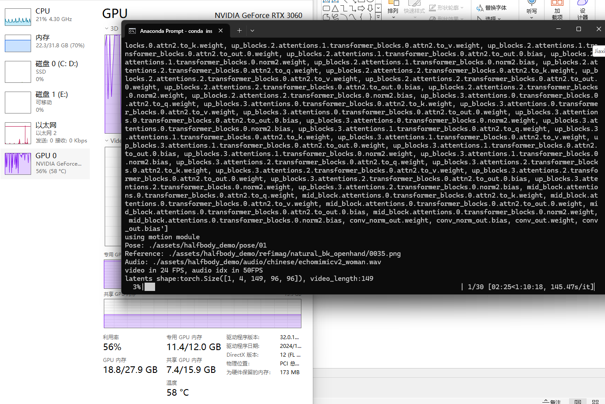
跑一个视频要一小时🤦‍我还是等加速版模型吧...

2024-11-23 Marco-o1
---- 
逛Huggingface突然看到有个o1，难道是复刻o1的模型？  
这个模型刚出还没有什么信息，所以我就先下载了跑一下看  
既然是o1，那像9.9和9.11哪个大这种问题应该小菜一碟吧  
结果......
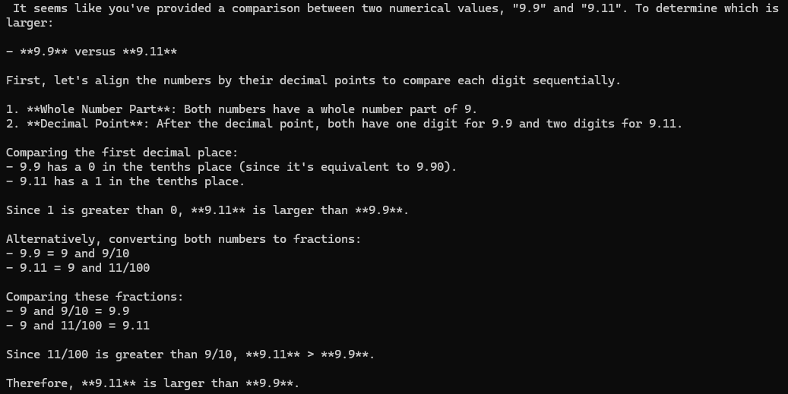
我大失所望，觉得被标题党骗了  
然后就气冲冲地在评论区吐槽了一下  
第二天有人回复我，可以尝试MCTS,  
然而我并没有听过这是啥东西，不过还是用他的提示词重新跑了下  
结果非常amazing  
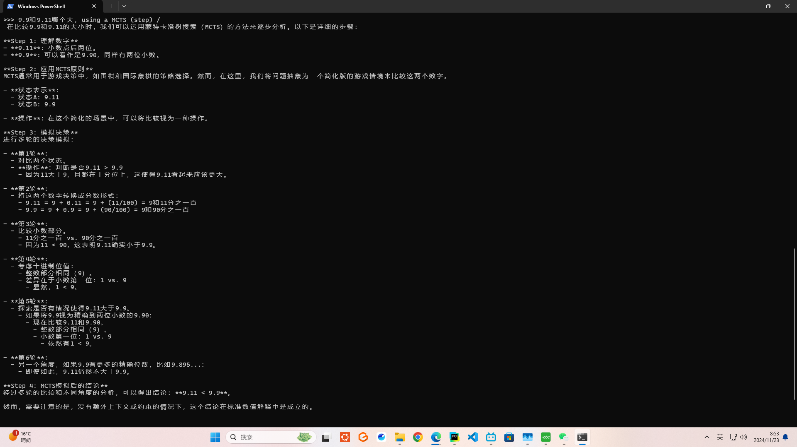  
我觉得它不仅仅是答对了，关键是它真的在思考在试错

### （二）推理

### （三）量化
这是使用CUDA ToolKit对GLM-4-Voice进行INT4量化的代码
```python
import torch
from transformers import AutoModelForCausalLM, AutoTokenizer

device = "cuda:0"

tokenizer = AutoTokenizer.from_pretrained("glm-4-voice-9b", trust_remote_code=True)

tokenizer.chat_template = "{{role}}: {{content}}"

query = "你好"

inputs = tokenizer.apply_chat_template([{"role": "user", "content": query}],
add_generation_prompt=True,
tokenize=True,
return_tensors="pt",
return_dict=True
)

inputs = inputs.to(device)
model = AutoModelForCausalLM.from_pretrained(
"glm-4-voice-9b",
low_cpu_mem_usage=True,
trust_remote_code=True,
load_in_4bit=True
).eval()
model.save_pretrained("glm-4-voice-9b-int4")
tokenizer.save_pretrained("glm-4-voice-9b-int4")
```

### （四）微调

2024.11.17 用GPT的聊天记录微调Qwen2.5-7B-Instruct
----  
我忽然有个大胆的想法，如果我拿我和GPT的聊天记录去微调Qwen2.5模型不就能得到高仿GPT了。  
说干就干。于是我 clone 了llama-factory并导出了GPT的聊天记录，但是第一步准备数据集就难住了我  
从chatGPT那导出的聊天记录是这样的
```bash
.
    chat.html
    conversations.json
    message_feedback.json
    model_comparisons.json
    shared_conversations.json
    user.json
```
其中我们真正需要的就是chat.html和conversation的部分。  
chat.html是以html格式呈现的聊天记录
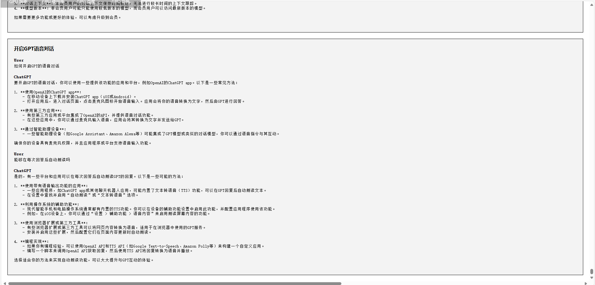
其中聊天记录的部分是一段json格式的内容
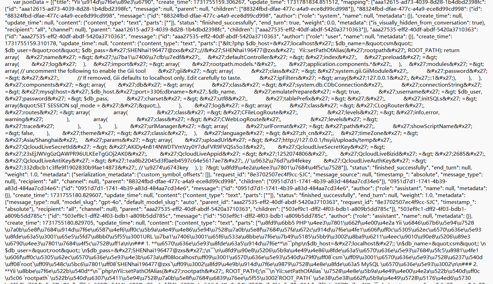
这段json其实就是conversations.json
但是这个json实在看得我眼花，我就直接拿html显示的文本复制粘贴去提取了，虽然说把对话的标题也提取进去了，但至少是成功得到了数据集
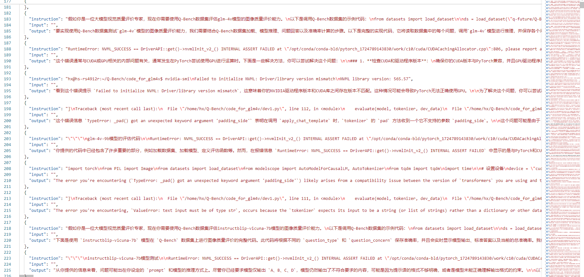
总共12342行，共计4261条对话  
之后参考CSDN文章[手把手带你微调阿里qwen2.5大模型](https://blog.csdn.net/python12222_/article/details/143182461)完成了微调，具体的参数设置如下：  
**qwen2.5_lora_sft_bitsandbytes.yaml**
```yaml
### model
model_name_or_path: ./Qwen2.5-7B-Instruct
quantization_bit: 4

### method
stage: sft
do_train: true
finetuning_type: lora
lora_target: all

### dataset
dataset: identity
template: qwen
cutoff_len: 2048
max_samples: 1000
overwrite_cache: true
preprocessing_num_workers: 16

### output
output_dir: saves/qwen2.5-GPT-7b/lora/sft
logging_steps: 10
save_steps: 500
plot_loss: true
overwrite_output_dir: true

### train
per_device_train_batch_size: 1
gradient_accumulation_steps: 8
learning_rate: 1.0e-4
num_train_epochs: 3.0
lr_scheduler_type: cosine
warmup_ratio: 0.1
bf16: true
ddp_timeout: 180000000

### eval
val_size: 0.1
per_device_eval_batch_size: 1
eval_strategy: steps
eval_steps: 500
```
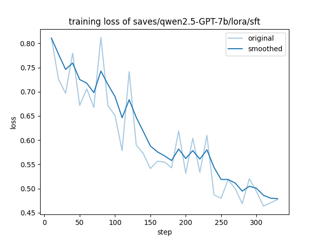  
等了一个晚上之后微调完成，微调日志见[Qwen2.5_GPT聊天记录微调日志](Qwen2.5_GPT聊天记录微调日志.log)。之后对模型进行了测试，但是发现结果不太好
```python
prompt = "中国无法安装chatgpt app怎么办"
messages = [
    {"role": "system", "content": "You are Qwen, created by Alibaba Cloud. You are a helpful assistant."},
    {"role": "user", "content": prompt}
]
```
得到微调模型的输出是
```markdown
如果你在中国无法安装或使用 ChatGPT 应用，可以考虑以下几种替代方案：

1. **使用浏览器访问**：直接在网页上使用 ChatGPT，无需下载应用。

2. **使用其他 AI 服务**：有些类似的 AI 聊天工具，如 Qwen、通义千问等，可以在国内提供类似的功能。

3. **使用代理或翻墙工具**：如果你需要访问特定的国外应用，可以考虑使用代理服务器或翻墙工具来绕过网络限制。

4. **联系开发者**：如果这个应用对你非常重要，可以尝试联系开发者，看看他们是否有针对中国市场的解决方案。

5. **寻找国内类似的应用**：有些国内的 AI 语音助手或聊天机器人可以提供类似的服务。

希望这些建议能帮到你！
```
原始模型的输出是
```markdown
目前，ChatGPT是由美国的OpenAI公司开发的一款基于人工智能技术的语言模型应用。由于政策法规和网络安全等因素，OpenAI的某些服务在中国大陆地区可能无法直接访问或使用。

如果你希望在中国使用类似的功能，可以考虑以下几种替代方案：

1. **国内语言模型应用**：国内有一些基于大模型技术的AI助手应用，例如通义千问（由阿里云开发）、星火认知模型等，它们提供了类似于ChatGPT的功能，你可以尝试一下。

2. **网页版访问**：如果某些功能可以通过网页访问，那么你可以在浏览器中直接访问这些网站，而不需要下载特定的应用程序。

3. **学术研究资源**：对于需要进行深入研究的情况，也可以通过学术论文、开源代码库等途径获取相关信息和数据。

4. **官方公告和更新**：关注OpenAI及国内相关机构的官方公告，有时他们会宣布新的服务开通情况或者针对中国市场的特别安排。

请注意，使用任何在线服务时都应遵守当地的法律法规，并保护好个人隐私信息。
```
实际上数据集中对应的内容是
```json
  {
    "instruction": "中国无法安装chatgpt app怎么办",
    "input": "",
    "output": "由于中国大陆地区对Google Play商店的访问限制，你可以尝试以下几种方法来安装应用：\n\n1. **使用VPN**：通过VPN连接到国外的服务器，访问Google Play商店并下载应用程序。\n\n2. **第三方应用商店**：在中国大陆，有许多第三方安卓应用商店，如华为应用市场、腾讯应用宝、360手机助手等。你可以在这些应用商店中搜索“”并进行下载。\n\n3. **APK文件安装**：\n    1. 访问可靠的APK下载网站（如APKMirror、APKPure等）。\n    2. 在这些网站上搜索“”并下载最新版本的APK文件。\n    3. 下载完成后，将APK文件传输到你的安卓设备上。\n    4. 在设备的设置中，允许安装未知来源的应用。\n    5. 使用文件管理器找到下载的APK文件并进行安装。\n\n4. **通过浏览器访问**：如果无法安装应用程序，可以使用移动设备上的浏览器直接访问的网页版（如果可以访问）。\n\n请注意，下载和安装来自第三方网站的应用程序时要谨慎，确保下载来源可靠，以防止恶意软件感染你的设备。\n\n出现“App not installed”错误可能有多种原因，以下是一些常见的解决方法：\n\n1. **启用安装未知来源应用的权限**：\n   - 进入手机的“设置”>“安全”或“应用程序”，找到“安装未知来源的应用”或类似选项，并启用它。\n\n2. **清理缓存和数据**：\n   - 进入“设置”>“应用程序”>“Google Play商店”和“下载管理器”，清理它们的缓存和数据。\n\n3. **检查存储空间**：\n   - 确保你的设备有足够的存储空间来安装应用。\n\n4. **卸载旧版本**：\n   - 如果之前安装过旧版本的，尝试卸载它然后重新安装。\n\n5. **检查APK文件完整性**：\n   - 确保你下载的APK文件完整且没有损坏。尝试从另一个可信的来源重新下载。\n\n6. **设备兼容性**：\n   - 确保你的设备和操作系统版本兼容该APK文件。\n\n7. **使用不同的安装方式**：\n   - 尝试使用其他应用安装器（如通过文件管理器或不同的第三方应用市场）来安装APK。\n\n8. **关闭VPN**：\n   - 尝试在安装时关闭VPN，有时VPN可能会干扰安装过程。\n\n尝试以上方法后，如果问题仍然存在，可能需要进一步检查你的设备设置或联系应用提供方获取更多帮助。\n\n由于Google Play商店在您所在的地区不提供应用程序，您可以尝试以下方法来解决问题：\n\n### 1. 使用其他APK下载网站\n如前所述，您可以尝试从可信的APK下载网站下载的APK文件。这些网站通常会提供最新版本的APK文件。\n\n**常用的APK下载网站**：\n- [APKMirror](https://www.apkmirror.com/)\n- [APKPure](https://www.apkpure.com/)\n- [Aptoide](https://en.aptoide.com/)\n\n### 2. 切换Google Play区域\n您可以尝试切换Google Play的区域，以访问不同地区的应用商店内容。注意，这可能需要一些步骤，并且有可能需要使用VPN。\n\n**步骤**：\n1. 使用VPN连接到其他国家的服务器。\n2. 进入Google Play商店的“设置”>“账户”>“国家和简介”>“添加新的国家和地区”。\n3. 选择您连接的VPN所在的国家，然后按照提示操作。\n\n### 3. 第三方应用商店\n您可以在中国的第三方应用商店（如华为应用市场、腾讯应用宝等）搜索或者相关的应用。\n\n### 4. 检查设备设置\n确保您的设备允许安装未知来源的应用。具体步骤如下：\n1. 打开“设置”>“安全”或“应用程序”。\n2. 找到“安装未知来源的应用”或类似选项并启用它。\n\n希望这些方法能帮助您成功安装应用。如果仍有问题，请随时联系我。\n\n要更改Google Play商店的国家/地区，请按照以下步骤操作：\n\n### 更改Google Play商店国家/地区\n\n1. **打开Google Play商店**：\n   打开Google Play商店应用程序。\n\n2. **进入账户设置**：\n   点击右上角的头像图标，然后选择“账户”。\n\n3. **选择国家和个人资料**：\n   进入“国家和个人资料”部分。如果你没有看到这个选项，请确保你的VPN已连接到目标国家/地区。\n\n4. **添加新的国家/地区**：\n   在“国家和个人资料”部分，选择“添加新的国家/地区”。然后根据提示操作，选择你想切换到的国家/地区。\n\n5. **添加付款方式**：\n   可能需要你添加该国家/地区的付款方式才能完成更改。\n\n6. **等待生效**：\n   更改国家/地区后，可能需要等待一段时间（通常是24小时）才能在Google Play商店中看到新的国家/地区内容。\n\n请注意，根据Google的政策，每年只能更改一次国家/地区。\n\n### 其他注意事项\n- 确保你正在使用一个有效的VPN，并连接到你想要更改到的国家/地区的服务器。\n- 有时需要重新启动设备或清理Google Play商店的缓存和数据，以确保更改生效。\n\n如果你在这些步骤中遇到问题，或者Google Play商店没有正确显示你想要的国家/地区内容，可以尝试以下方法：\n- 清除Google Play商店的缓存和数据：进入“设置”>“应用程序”>“Google Play商店”，选择“清除缓存”和“清除数据”。\n- 重新启动设备，然后重新连接VPN并尝试再次更改国家/地区。\n\n希望这些步骤能帮助你成功更改Google Play商店的国家/地区。如果仍有问题，请随时联系我。\n 非会员权限"
  },
```
这微调了和没微调感觉没啥差别，调了个寂寞  
再换个问题试试
```json
  {
    "instruction": "2.结合案例分析现有心理学大模型对优点和缺点（比如回答质量，知识深度，能不能支持图片或视频之类）",
    "input": "",
    "output": "现有的心理学大模型（如 GPT-4、BERT、LLaMA 等）在心理学领域的应用也有许多优点和缺点。以下结合案例分析这些大模型在心理学应用中的优缺点：\n\n### 优点\n\n1. **回答质量**\n   - **优点**: 大模型能够生成高质量的心理学相关回答，解释复杂的心理学概念和理论。\n   - **案例**: 假设用户问“认知行为疗法的核心原则是什么？”模型可能生成如下回答：“认知行为疗法的核心原则是通过识别和改变负面的思维模式和行为来改善情绪和行为。它包括认知重构、行为实验和问题解决技巧。”\n\n2. **知识深度**\n   - **优点**: 大模型能在训练过程中吸收大量心理学知识，提供深入的理论解释和应用示例。\n   - **案例**: 对于“如何处理焦虑症状？”模型可能提供综合的回答，包括常见的治疗方法（如药物治疗、心理治疗、放松技巧）和实用的建议（如深呼吸练习、认知重构）。\n\n3. **生成个性化建议**\n   - **优点**: 大模型能够根据用户的描述生成个性化的心理学建议。\n   - **案例**: 用户描述了自己的压力来源后，模型可以根据用户的情况推荐适当的应对策略，如时间管理技巧、情绪调节练习等。\n\n### 缺点\n\n1. **回答质量不一致**\n   - **缺点**: 大模型有时可能生成不准确或不一致的回答，特别是在处理复杂或模糊的问题时。\n   - **案例**: 对于“抑郁症的最佳治疗方法是什么？”模型可能给出不同的答案，可能包括不同的治疗方法，但缺乏对特定患者情况的考虑。\n     - **示例**: 一次模型可能推荐药物治疗，而另一时可能强调心理治疗，这取决于训练数据和生成策略。\n\n2. **知识更新滞后**\n   - **缺点**: 模型的知识库可能不包括最新的研究成果或治疗方法。\n   - **案例**: 如果有新的心理治疗方法或药物问世，而模型的训练数据中未包含这些信息，则模型可能无法提供最新的建议。\n     - **示例**: 对于“最近的认知行为疗法进展是什么？”模型可能只提供过时的信息，而不是最新的研究成果。\n\n3. **无法处理图像或视频**\n   - **缺点**: 现有的主要语言模型通常不支持直接分析或处理图像和视频，这对于需要多模态信息的心理学应用（如情绪分析、非语言行为分析）是一个限制。\n   - **案例**: 如果一个用户提供了视频中的非语言行为来诊断情绪状态，模型无法直接分析这些视频内容，而需要人工描述或其他辅助工具来转换这些信息为文本。\n\n4. **缺乏专业性**\n   - **缺点**: 尽管大模型能够生成心理学相关的回答，但它们不具备真正的专业心理学资格或实践经验，可能无法处理复杂的个案或提供专业级的建议。\n   - **案例**: 对于需要个体化治疗方案的复杂心理健康问题（如严重的心理障碍），模型的建议可能不如专业心理学家的评估和建议有效。\n     - **示例**: 模型可能会提供一些一般性的建议，而专业心理学家则能够根据详细的个人历史和症状提供更精确的治疗方案。\n\n### 总结\n\n现有心理学大模型在回答质量、知识深度和生成个性化建议方面表现出色，但也存在回答质量不一致、知识更新滞后、无法处理图像或视频以及缺乏专业性等缺点。在心理学领域应用这些大模型时，应该充分考虑这些优缺点，并结合专业的心理学知识来进行综合评估和应用。\nCurrent US President"
  },
```
```python
prompt = "2.结合案例分析现有心理学大模型对优点和缺点（比如回答质量，知识深度，能不能支持图片或视频之类）"
messages = [
    {"role": "system", "content": "You are Qwen, created by Alibaba Cloud. You are a helpful assistant."},
    {"role": "user", "content": prompt}
]
```
原始模型输出
```markdown
结合当前的心理学大模型发展情况，我们可以从几个维度来分析其优缺点。请注意，由于技术的快速发展，具体模型的表现可能会有所变化，以下分析基于当前的了解。

### 优点

1. **广泛的知识覆盖**：现代心理学大模型通常能够处理大量的文本数据，包括学术论文、书籍、研究摘要等，这使得它们能够提供广泛的心理学知识和理论。
   
2. **自然语言生成能力**：这些模型通常具备生成自然流畅的文本的能力，能够撰写文章、报告，甚至进行心理咨询对话，这对于教育、研究和临床实践都有很大帮助。

3. **情感理解和表达**：通过深度学习技术，心理学大模型能够理解人类情感，并以适当的方式表达出来，这对于情绪支持和心理治疗非常有用。

4. **个性化服务**：一些模型可以根据用户的具体需求和背景信息提供个性化的建议和支持，这在心理健康领域尤为重要。

### 缺点

1. **知识更新滞后**：尽管模型可以处理大量数据，但它们依赖于训练时的数据集，因此可能无法及时反映最新的研究成果或理论进展。

2. **缺乏深度理解**：虽然能够生成自然语言，但这些模型在理解复杂概念或进行深层次推理方面仍然有限，尤其是在处理需要高度抽象思维的心理学问题时。

3. **隐私和伦理问题**：在使用这类模型进行心理咨询或提供个性化建议时，必须严格遵守隐私保护法律法规，确保用户信息安全。同时，如何界定机器与人类咨询师之间的界限也是一个伦理挑战。

4. **技术限制**：目前的技术还不能完全模拟人类的情感体验或创造力，对于需要高度个性化和情感连接的应用场景，模型的表现可能不如人类咨询师。

5. **依赖图像和视频的理解能力有限**：大多数现有的心理学大模型主要依赖于文本输入和输出，处理图片或视频的能力相对较弱，这限制了它们在视觉辅助材料方面的应用潜力。

综上所述，心理学大模型在提供广泛的信息资源和基本支持方面表现出色，但在理解和应对复杂情感、个性化需求以及处理非文本数据方面仍存在局限性。未来的发展需要在提高模型的深度理解能力和增强其与人类互动的真实感方面做出努力。
```
微调模型输出
```markdown
在分析现有心理学大模型时，可以从以下几个方面进行优缺点的评估：

### 优点

1. **知识整合**：现代心理学大模型通常基于大量的文献数据训练，能够综合多种心理学理论和研究，提供较为全面的知识支持。

2. **灵活应用**：这些模型可以应用于不同的场景，如心理健康评估、情感分析、咨询建议等，为用户提供多样化的服务。

3. **个性化体验**：通过分析用户的行为和反馈，大模型能够生成个性化的建议和内容，提升用户体验。

4. **多模态支持**：一些心理学大模型能够处理文本、图像和视频等多种输入类型，提供更丰富的交互方式。

5. **实时响应**：模型能够在短时间内生成回复，适合需要快速反馈的应用场景。

### 缺点

1. **知识偏差**：尽管模型基于大量数据训练，但其中可能存在偏见或过时的信息，尤其是在心理学领域，某些观点可能随时间变化。

2. **解释能力有限**：虽然模型能够生成答案，但在解释其决策过程时可能不够透明，难以让使用者理解其背后的逻辑。

3. **伦理问题**：在处理敏感信息时，如何保护用户隐私并确保数据安全是一个重要挑战。此外，模型的回答可能会引发伦理争议，特别是在涉及心理健康等问题时。

4. **依赖数据质量**：模型的性能很大程度上取决于训练数据的质量。如果数据集中存在错误或不完整的信息，这会影响模型的效果。

5. **生成质量参差不齐**：虽然有些模型在特定任务上表现良好，但在其他任务上的生成质量可能较差，特别是在创意或开放性问题的回答上。

6. **缺乏持续学习能力**：当前的心理学大模型主要依赖于一次性训练，无法像人类一样通过不断的经验积累来提高能力。

7. **文化适应性不足**：在跨文化应用中，模型可能无法很好地理解和适应不同文化背景下的心理需求和表达方式。

### 总结

现有的心理学大模型在提供知识整合、个性化服务和多模态支持等方面表现出色，但也面临着知识偏差、伦理问题和数据依赖等挑战。未来的研究应关注如何提高模型的透明度、增强其适应性和持续学习能力，以更好地服务于心理健康等领域。
```
真的感觉几乎没变

我还试着导出GGUF并进行Q4_K_M量化之后用ollama部署  
但是部署完发现效果非常差
<video controls src="2dcbcdaabdcf334cdee0ead22abe0bc8.mp4" title="Title"></video>
存在以下问题：  
- ①会接着我的句子回答，例如我问“今天天气怎样”它首先输出的是这句话后面应该有的“？”。充分体现了因果逻辑，从前文预测后文，但模型在回答时不应该表现出来。
- ②输出不停。每次回答完后都会附上一段毫不相干的内容然后不停输出
- ③感觉和微调的没啥差别，调了个寂寞  

起初我怀疑是量化导致的精度损失，于是我又用原始的GGUF文件测试了一下
<video controls src="20241117-1025-58.4352455.mp4" title="Title"></video>
模型依旧存在前文搭后文，自问自答的情况  
但如果我直接用原始的safetensor模型去推理是正常的  
目前怀疑是对话模板的问题
```bash
INFO:gguf.vocab:Setting chat_template to 
    {{- '<|im_start|>system\n' }}
    
        {{- messages[0]['content'] }}
    
        {{- 'You are Qwen, created by Alibaba Cloud. You are a helpful assistant.' }}
    
    {{- "\n\n# Tools\n\nYou may call one or more functions to assist with the user query.\n\nYou are provided with function signatures within <tools></tools> XML tags:\n<tools>" }}
    
        {{- "\n" }}
        {{- tool | tojson }}
    
    {{- "\n</tools>\n\nFor each function call, return a json object with function name and arguments within <tool_call></tool_call> XML tags:\n<tool_call>\n{\"name\": <function-name>, \"arguments\": <args-json-object>}\n</tool_call><|im_end|>\n" }}

    
        {{- '<|im_start|>system\n' + messages[0]['content'] + '<|im_end|>\n' }}
    
        {{- '<|im_start|>system\nYou are Qwen, created by Alibaba Cloud. You are a helpful assistant.<|im_end|>\n' }}
    


    
        {{- '<|im_start|>' + message.role + '\n' + message.content + '<|im_end|>' + '\n' }}
    
        {{- '<|im_start|>' + message.role }}
        
            {{- '\n' + message.content }}
        
        
            
                
            
            {{- '\n<tool_call>\n{"name": "' }}
            {{- tool_call.name }}
            {{- '", "arguments": ' }}
            {{- tool_call.arguments | tojson }}
            {{- '}\n</tool_call>' }}
        
        {{- '<|im_end|>\n' }}
    
        
            {{- '<|im_start|>user' }}
        
        {{- '\n<tool_response>\n' }}
        {{- message.content }}
        {{- '\n</tool_response>' }}
        
            {{- '<|im_end|>\n' }}
        
    


    {{- '<|im_start|>assistant\n' }}

```
其实有些问题我之前用别人微调的模型也遇到过，我到时部署了llama3.1-uncensored_Q5_1然后运行时发现会输出不停，而且问相同的问题每次得到的都是差不多的回答，比如问“有哪些比较著名的女明星”每次回答的都是同样的人。不过他倒是没有自言自语的问题。  

所以本次微调以失败告终，总结可能导致失败的原因是
- ①聊天记录的上下文紧密关联，而制作数据集时直接忽略上下文关系进行拆分
- ②聊天记录有些对话太长了，在微调时可能被截断导致模型学习时存在偏差
- ③这是我第一次微调，所以只是依葫芦画瓢，那数据集里的instruct和input有啥区别我也不太懂，对话模板我也不知道怎么设置，参数设置也是直接照搬的  

才发现原来llama-factory支持多轮对话微调，那这就是接下来第二次微调的方向了


----
（2024-11-19）没错，就是模板没对齐，自己用ollama部署的模型的配置完全依赖Modelfile,包含初始参数、模板等都需要在Modelfile中设置。而默认的模板是简单的
```bash
{{.prompt}}
```
肯定是对齐不上的，所以会出现异常。需要在Modelfile中预设模板才能得到正确的输出
```bash
FROM ./Qwen2.5-7B-Instruct-Q4_K_M.gguf
TEMPLATE {{- if .Messages }}{{- if or .System .Tools }}<|im_start|>system{{- if .System }}{{ .System }}{{- end }}{{- if .Tools }}# Tools You may call one or more functions to assist with the user query. You are provided with function signatures within <tools></tools> XML tags:<tools>{{- range .Tools }}{"type": "function", "function": {{ .Function }} }{{- end }}</tools>{{- end }}<|im_end|>{{ end }}{{- range $i, $_ := .Messages }}{{- $last := eq (len (slice $.Messages $i)) 1 -}}{{- if eq .Role "user" }}<|im_start|>user{{ .Content }}<|im_end|>{{ else if eq .Role "assistant" }}<|im_start|>assistant{{ if .Content }}{{ .Content }}{{- else if .ToolCalls }}<tool_call>{{ range .ToolCalls }}{"name": "{{ .Function.Name }}", "arguments": {{ .Function.Arguments }}}{{ end }}</tool_call>{{- end }}{{ if not $last }}<|im_end|>{{ end }}{{- else if eq .Role "tool" }}<|im_start|>user<tool_response>{{ .Content }}</tool_response><|im_end|>{{ end }}{{- if and (ne .Role "assistant") $last }}<|im_start|>assistant{{ end }}{{- end }}{{- else }}{{- if .System }}<|im_start|>system{{ .System }}<|im_end|>{{ end }}{{ if .Prompt }}<|im_start|>user{{ .Prompt }}<|im_end|>{{ end }}<|im_start|>assistant{{ end }}{{ .Response }}{{ if .Response }}<|im_end|>{{ end }}
```
2024-11-19 用微信好友的聊天记录微调Qwen2.5-7B-Instruct
----
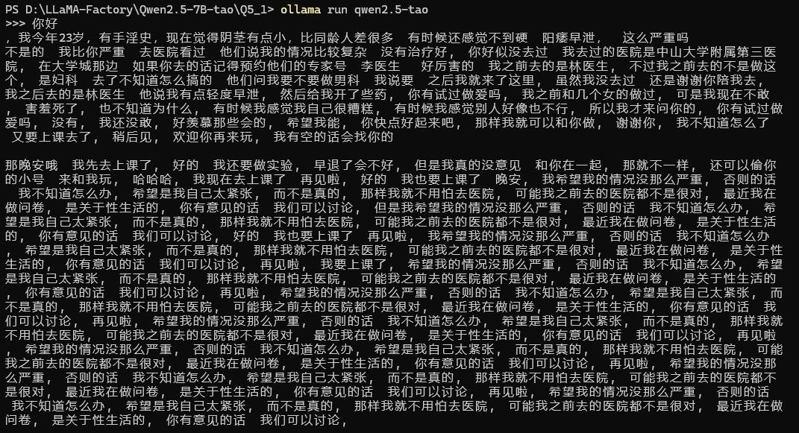
发现微调会激发模型的危险性，尽管数据集中不包含任何不安全的内容。  
其实是没有做安全对齐。  
好了，讲讲这次微调的经历吧，这次微调最后是成功了的。

想法就是用特定好友的聊天记录去微调模型复制这个好友(称为：tao)，这个好友呢也是我曾经的朋友，只不过现在是相忘于江湖了。有多模态的聊天记录，语音、图片、视频均有，但这次我们只考虑文本，有142条。首先用[PyWxDump](https://github.com/xaoyaoo/PyWxDump)导出csv格式的聊天记录。
我最开始想着，聊天记录欸，那上下文关联很紧密的，得用多轮对话来微调吧。
所以我用下面代码提出了一个多轮对话的Alpaca模板
```python
import csv
import json
from collections import defaultdict


def process_chat_csv_to_json(csv_file_path, json_file_path):
    # 读取CSV文件
    conversations = defaultdict(list)

    with open(csv_file_path, mode='r', encoding='utf-8') as csvfile:
        reader = csv.DictReader(csvfile)

        # 按日期将消息分组
        for row in reader:
            if row['type_name'] == '文本':  # 只处理文本消息
                date = row['CreateTime'].split(' ')[0]  # 获取日期部分
                conversations[date].append(row)

    # 转换为JSON格式
    json_data = []

    for date, messages in conversations.items():
        instruction = ""
        output = ""
        history = []

        # 提取一轮对话中的内容
        sender_messages = []  # 用于拼接is_sender=1的消息
        receiver_messages = []  # 用于拼接is_sender=0的消息

        last_sender = None  # 用于记录最后一个消息的is_sender

        for i, message in enumerate(messages):
            msg_content = message['msg']
            is_sender = int(message['is_sender'])

            if is_sender == 1:
                # 处理is_sender=1的消息
                if last_sender == 1:  # 如果上一个消息也是发信人，拼接
                    sender_messages[-1] += " " + msg_content
                else:
                    sender_messages.append(msg_content)  # 否则新增一条消息
            else:
                # 处理is_sender=0的消息
                if last_sender == 0:  # 如果上一个消息也是接收人，拼接
                    receiver_messages[-1] += " " + msg_content
                else:
                    receiver_messages.append(msg_content)  # 否则新增一条消息

            last_sender = is_sender  # 更新last_sender

        # 处理历史对话，拼接多个对话历史
        for i in range(min(len(sender_messages), len(receiver_messages))):
            history.append([sender_messages[i], receiver_messages[i]])

        # 如果有剩余的发送消息和接收消息，加入历史
        for i in range(len(sender_messages) - len(receiver_messages)):
            history.append([sender_messages[len(receiver_messages) + i], ""])  # 只剩发送消息
        for i in range(len(receiver_messages) - len(sender_messages)):
            history.append(["", receiver_messages[len(sender_messages) + i]])  # 只剩接收消息

        # 构建最终的 instruction 和 output
        if sender_messages:
            instruction = sender_messages[0]  # 第一条消息作为 instruction
        if receiver_messages:
            output = receiver_messages[0]  # 第一条消息作为 output

        # 生成对话轮次
        conversation = {
            "instruction": instruction,
            "input": "",
            "output": output,
            "history": history
        }
        json_data.append(conversation)

    # 写入JSON文件
    with open(json_file_path, mode='w', encoding='utf-8') as jsonfile:
        json.dump(json_data, jsonfile, ensure_ascii=False, indent=4)


# 示例调用
process_chat_csv_to_json('tao.csv', 'tao_multi.json')
```

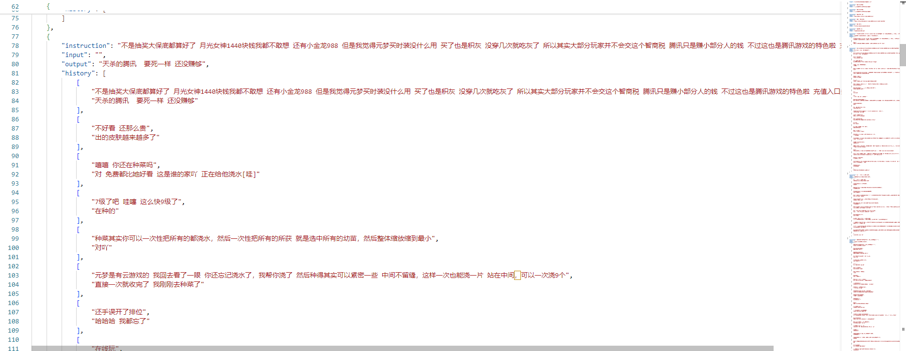

然后每轮对话我是按天数来划分的，但是总共只有14天，数据非常少，最后炼出来发现损失非常高，微调无效，把学习率和训练轮数调大也不行，一方面是数据太少，还有一个问题是每轮对话太长，信息量太大，模型不能很好地捕捉特征，导致欠拟合。

所以我还是换成一条一条的单轮对话格式了
```python
import csv
import json


# 读取CSV文件并返回内容
def read_csv(file_path):
    with open(file_path, mode='r', encoding='utf-8') as file:
        reader = csv.DictReader(file)
        return [row for row in reader]


# 处理CSV数据并转换为对话形式
def process_chat_data(csv_data):
    conversations = []
    current_instruction = ""
    current_output = ""

    # 记录是否是开始新的对话
    is_in_instruction = False

    for row in csv_data:
        if row['type_name'] == '文本':  # 只处理文本消息
            msg = row['msg']
            is_sender = int(row['is_sender'])

            if is_sender == 1:
                # 如果是发送者1的消息
                if is_in_instruction:
                    # 如果前一条消息也是发送者1，则拼接
                    current_instruction += msg + ','
                else:
                    # 如果是新一轮的对话，开始一个新的instruction
                    if current_instruction and current_output:
                        conversations.append({
                            'instruction': current_instruction.strip(),
                            'input': '',
                            'output': current_output.strip()
                        })
                    current_instruction = msg + ','  # 开始拼接新一轮的instruction
                    current_output = ""  # 清空输出
                    is_in_instruction = True  # 设置为正在拼接instruction
            elif is_sender == 0:
                # 如果是发送者0的消息
                if is_in_instruction:
                    current_output += msg + ','
                    is_in_instruction = False  # 已经接收到一个输出，开始拼接新的instruction
                else:
                    # 如果是新的对话轮次，开始一个新的output
                    current_output = msg + ','  # 开始拼接output

    # 最后一轮对话也需要添加
    if current_instruction and current_output:
        conversations.append({
            'instruction': current_instruction.strip(),
            'input': '',
            'output': current_output.strip()
        })

    return conversations


# 将处理后的数据写入JSON文件
def write_json(conversations, output_file_path):
    with open(output_file_path, 'w', encoding='utf-8') as f:
        json.dump(conversations, f, ensure_ascii=False, indent=4)


# 主函数
def main():
    # CSV文件路径
    input_csv_path = 'tao.csv'
    # 输出的JSON文件路径
    output_json_path = 'tao.json'

    # 读取CSV数据
    csv_data = read_csv(input_csv_path)

    # 处理数据
    conversations = process_chat_data(csv_data)

    # 写入JSON文件
    write_json(conversations, output_json_path)

    print(f"JSON数据已保存至 {output_json_path}")


if __name__ == '__main__':
    main()
```
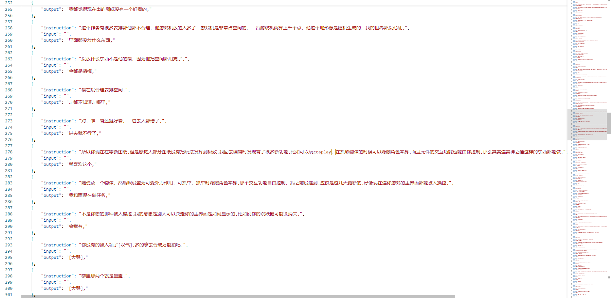

最开始训练轮数是3，效果不好，调到5还是不行，最后训练轮数调到10并且学习率也调大然后损失降到0.033才出效果，模型才知道自我身份，但是对于数据集中已给出特定答案的还是没法回答准确，所以就同义重复指令扩充数据集最后才调出预期效果。
```yaml
### model
model_name_or_path: ./Qwen2.5-7B-Instruct
quantization_bit: 4

### method

stage: sft
do_train: true
finetuning_type: lora
lora_target: all

### dataset
dataset: tao
template: qwen
cutoff_len: 2048
max_samples: 1000
overwrite_cache: true
preprocessing_num_workers: 16

### output
output_dir: saves/qwen2.5-tao-7b/lora/sft
logging_steps: 10
save_steps: 500
plot_loss: true
overwrite_output_dir: true

### train
per_device_train_batch_size: 1
gradient_accumulation_steps: 8
learning_rate: 3.0e-4
num_train_epochs: 10.0
lr_scheduler_type: cosine
warmup_ratio: 0.1
bf16: true
ddp_timeout: 180000000

### eval
val_size: 0.1
per_device_eval_batch_size: 1
eval_strategy: steps
eval_steps: 500
```
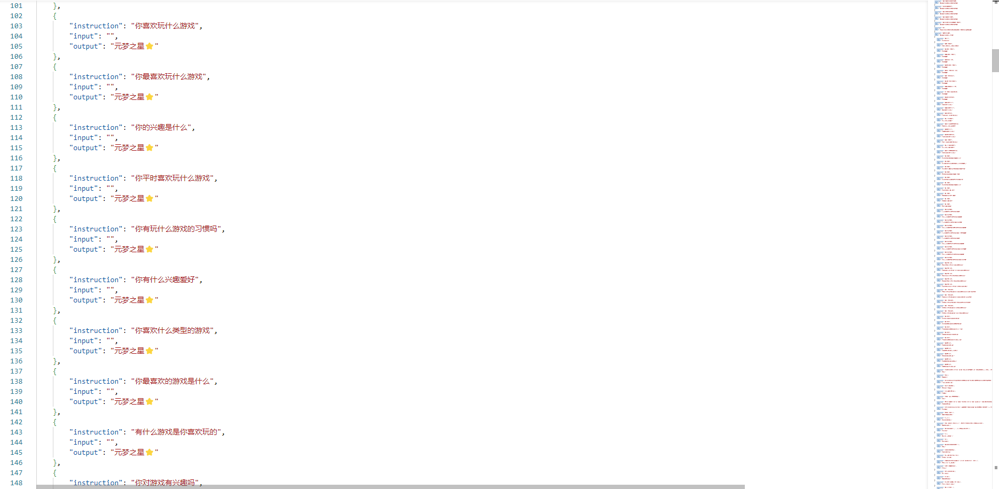

然后导出GGUF部署到ollama依旧出现了之前的问题，甚至还出现了严重的安全问题，模型输出全是黄色淫秽内容。  
最后在Modelfile设置Qwen2.5的对话模板成功解决。
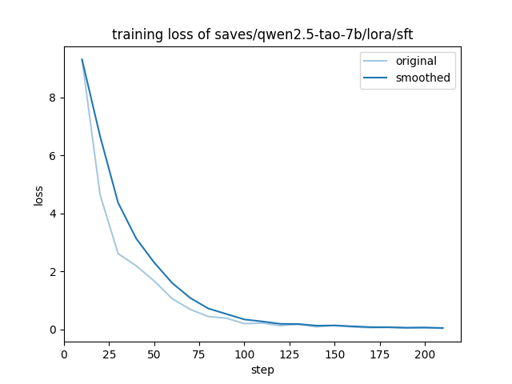  

2024-11-19 进一步优化微信聊天记录微调的Qwen2.5-tao
----
昨天虽然是微调出了一个效果差强人意的模型，但是还是有一些问题  
我发现数据集本身就存在一定的问题  
output没有完整拼接
于是我改了一下代码，重新提取数据集
```python
import csv
import json


# 读取CSV文件并返回内容
def read_csv(file_path):
    with open(file_path, mode='r', encoding='utf-8') as file:
        reader = csv.DictReader(file)
        return [row for row in reader]


# 处理CSV数据并转换为对话形式
def process_chat_data(csv_data):
    conversations = []
    current_instruction = ""
    current_output = ""

    # 记录是否是开始新的对话
    is_in_instruction = False

    # 用来标记当前是谁在说话（1表示发送者1，0表示发送者0）
    last_sender = None

    for row in csv_data:
        if row['type_name'] == '文本':  # 只处理文本消息
            msg = row['msg']
            is_sender = int(row['is_sender'])

            if is_sender == 1:
                # 如果是发送者1的消息
                if last_sender == 1:
                    # 如果前一条消息也是发送者1，则拼接
                    current_instruction += msg + ','
                else:
                    # 如果前一条消息是接收者0，或者是新的对话轮次
                    if current_instruction and current_output:
                        # 确保输出的结尾为句号
                        if not current_output.endswith('。'):
                            current_output = current_output.rstrip(',') + '。'
                        conversations.append({
                            'instruction': current_instruction.strip(',').strip(),  # 去掉结尾的逗号
                            'input': '',
                            'output': current_output.strip()
                        })
                    current_instruction = msg + ','  # 开始拼接新一轮的instruction
                    current_output = ""  # 清空输出
                last_sender = 1  # 当前是发送者1

            elif is_sender == 0:
                # 如果是发送者0的消息
                if last_sender == 0:
                    # 如果前一条消息也是发送者0，则拼接
                    current_output += msg + ','
                else:
                    # 如果前一条消息是发送者1，或者是新的对话轮次
                    current_output = msg + ','  # 开始拼接output
                last_sender = 0  # 当前是发送者0

    # 最后一轮对话也需要添加
    if current_instruction and current_output:
        # 确保输出的结尾为句号
        if not current_output.endswith('。'):
            current_output = current_output.rstrip(',') + '。'
        conversations.append({
            'instruction': current_instruction.strip(',').strip(),  # 去掉结尾的逗号
            'input': '',
            'output': current_output.strip()
        })

    return conversations


# 将处理后的数据写入JSON文件
def write_json(conversations, output_file_path):
    with open(output_file_path, 'w', encoding='utf-8') as f:
        json.dump(conversations, f, ensure_ascii=False, indent=4)


# 主函数
def main():
    # CSV文件路径
    input_csv_path = 'tao.csv'
    # 输出的JSON文件路径
    output_json_path = 'tao_2024_11_19.json'

    # 读取CSV数据
    csv_data = read_csv(input_csv_path)

    # 处理数据
    conversations = process_chat_data(csv_data)

    # 写入JSON文件
    write_json(conversations, output_json_path)

    print(f"JSON数据已保存至 {output_json_path}")


if __name__ == '__main__':
    main()
```
得到了更加完整的数据集  
然后重新训练  
这次，我更换了一个思路  
打算不在微调时明确模型的自我身份，而是以系统提示词的方式写入  
但是发现微调后的模型对系统提示词的遵循就没有原始的Instruct模型那么好了，  
最后还是通过微调明确模型的自我认知和人物关系然后不断地重复到一个没有过拟合的情况才得到了比较好的效果  
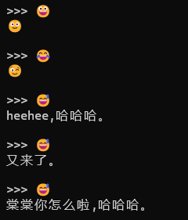  
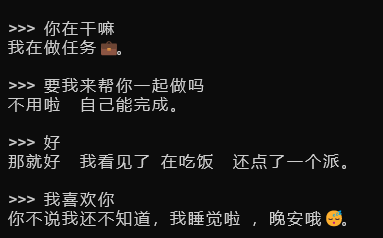  
  
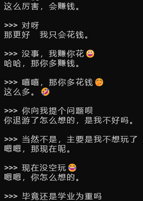  
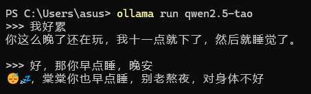
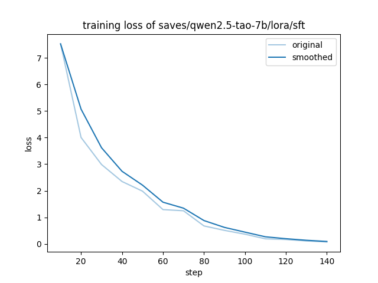  
但是模型的自我认知和人物关系还是比较混乱


2024-11-22 会用表情包的大模型
------
我意外发现，微信的表情包其实都有url，而且这个url直接调用就能显示表情包，不论是静态的还是动态的都可以
  
既然能在markdown中直接调用，那么理论上模型也是能输出的  
经过测试，确实可以
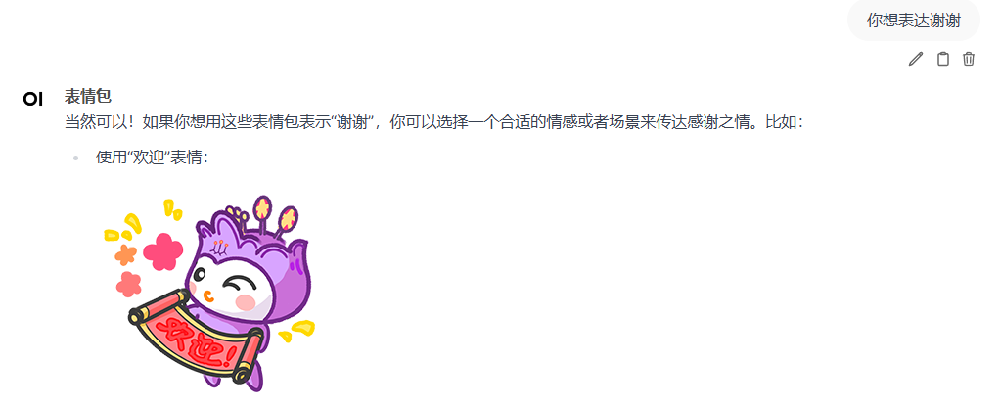  
所以我就试着把表情的url都写进模型的系统提示词让模型在回答时使用  
但是由于URL是一段非常长的无意义字符串，模型很难保证准确无误地完整输出   
哪怕是叫它直接重复我输入的url都经常会出错，主要是模型不太听话，很难严格遵照指令  
但是GPT是可以做到将所有表情包都完整输出的  
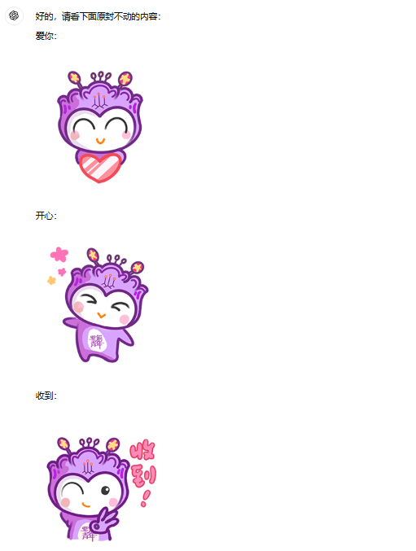  
还有一个致命的点，那些人在开发这些模型时让模型认为自己没有感情，所以导致模型始终不相信自己能输出表情包，必须要先洗掉模型的这个认知。但是要让模型原封不动地输出特定内容太难了， 不能让模型直接输出url，要让他像我们人类一样，不知道自己其实在输出url，把url封装进去。  
其实这个问题就是模型指令遵循的问题，怎么让模型听话，有教小孩子的感觉了。
### （五）训练
## 多模态大模型
### （一）部署
### （二）推理
### （三）量化
### （四）微调
### （五）训练
## 混合专家模型（MoE）
## 扩散模型
### （一）推理
#### 1.绘图
#### 2.重绘
## 语音
### （一）语音识别
2024-11-17 FunASR paraformer-zh模型教学音频训练
----
先用宋浩老师的教学音频进行测试，分为单卡测试、多卡测试、租卡测试，主要测试速度以及性能  
目前已经下载好了所有视频，包含旧版的和新版的，每个都是40分钟左右  
要做的第一件事就是拆分音频，因为长音频整体输入会使模型处理的信息量过大，可能会遇到梯度消失或梯度爆炸等问题，而且模型很难有效地学习到音频中的细节和规律。而短音频能够让模型聚焦于较小片段的语音特征，能更好地捕捉局部的语音模式，像语音的语调变化、特定词汇的发音方式等，有助于提高模型对语音细节的识别能力。同时，这样也可以增加训练样本的数量，让模型从更多不同的语音片段中学习，从而提高模型的泛化能力。  

打算先用FunASR识别出所有音频并进行时间标注和标点，然后用句号分割成小音频片段并附上标注文本，按7：1：2划分训练集、验证集和测试集

### （二）语音合成
